# 꾸독 : 나만의 구독 비서

**꾸독**은 다양한 구독 서비스를 손쉽게 찾아보고 관리할 수 있는 플랫폼입니다.

메인 페이지에서는 이벤트 배너, 전체 카테고리, 그리고 개인화된 추천 구독 서비스 리스트를 확인할 수 있습니다. 각종 필터, 통합 검색, 그리고 구독 서비스 비교 기능을 통해 사용자는 보다 쉽게 원하는 구독 서비스를 찾을 수 있습니다. 더불어, 회원가입 및 로그인을 통해 개인화된 마이페이지에서는 관심 상품, 구독 내역과 받고있는 혜택 및 한 달 요금, 그리고 작성한 리뷰를 효과적으로 관리할 수 있습니다. 관리자 페이지는 구독 서비스, 태그, 카테고리를 효율적으로 관리하고 이벤트를 운영할 수 있는 기능을 제공합니다.

## 👀 목차

- **[👀 URL과 임시 Admin 로그인 정보](#-url과-임시-admin-로그인-정보)**
- **[👨‍💼👩‍💼 팀원](#-팀원)**
- **[🛠️ 기술 스택과 채택 이유](#%EF%B8%8F-기술-스택과-채택-이유)**
  - [프론트엔드](#프론트엔드)
  - [백엔드](#백엔드)
- **[📰 플로우차트 및 ERD 테이블](#-플로우차트-및-erd-테이블)**
  - [플로우차트](#1-플로우차트)
  - [ERD 테이블](#2-erd테이블)
- **[💡 사용자 페이지 기능 소개](#-사용자-페이지-기능-소개)**
  - [1. 메인페이지 : 이벤트배너/전체카테고리/맞춤서비스 추천](#1-메인페이지--이벤트배너전체카테고리맞춤서비스-추천)
  - [2. 베스트](#2-베스트)
  - [3. 간편비교](#3-간편비교)
  - [4. 이벤트](#4-이벤트)
  - [5. 카테고리별 리스트 : 필터, 구독서비스 리스트](#5-카테고리별-리스트--필터-구독서비스-리스트)
  - [6. 검색결과 : 구독서비스명 또는 태그명](#6-검색결과--구독서비스명-또는-태그명)
  - [7. 구독서비스 상세페이지](#7-구독서비스-상세페이지)
  - [8. 구독하기, 구독변경/해지](#8-구독하기-구독변경해지)
  - [9. 로그인/회원가입](#9-로그인회원가입)
  - [10. 회원정보수정](#10-회원정보수정)
  - [11. 마이페이지 : 11-1. 나의 구독내역](#11-마이페이지--11-1-나의-구독내역)
  - [11. 마이페이지 : 11-2. 내가 작성한 리뷰](#11-마이페이지--11-2-내가-작성한-리뷰)
  - [11. 마이페이지 : 11-3. 관심서비스](#11-마이페이지--11-3-관심서비스)
  - [12. 편의성 기능 : 다크모드, 위로가기](#12-편의성-기능--다크모드-위로가기)
- **[🔨 관리자 페이지 기능 소개](#-관리자-페이지-기능-소개)**
  - [1. 메인대시보드 : 카테고리/구독서비스/태그/이벤트 관리](#1-메인대시보드--카테고리구독서비스태그이벤트-관리)
  - [2. 카테고리 관리 : 리스트, 등록, 수정, 삭제](#2-카테고리-관리--리스트-등록-수정-삭제)
  - [3. 구독서비스 관리 : 리스트, 등록, 수정 삭제](#3-구독서비스-관리--리스트-등록-수정-삭제)
  - [4. 태그 관리 : 리스트, 등록, 삭제](#4-태그-관리--리스트-등록-삭제)
  - [5. 이벤트 관리 : 리스트, 등록, 삭제](#5-이벤트-관리--리스트-등록-삭제)
- **[😥 아쉬운 점과 보완 방안](#-아쉬운-점과-보완-방안)**
  - [프론트엔드](#1-프론트엔드)
  - [백엔드](#2-백엔드)
- **[📑 이미지/아이콘 소스 출처](#-이미지아이콘-소스-출처)**

## 🏁 URL과 임시 Admin 로그인 정보

1. **URL:**

- [꾸독:나만의 구독 비서 ](http://ec2-43-202-123-248.ap-northeast-2.compute.amazonaws.com:8080/)

- [꾸독:관리자 (Admin 계정 로그인 후 접근 가능) ](http://ec2-43-202-123-248.ap-northeast-2.compute.amazonaws.com:8080/Admin/AdminHome)

2. **Github 코드 바로가기**

- [프론트 엔드 (pages)](https://github.com/Zoey-Sunlight/ggudok/tree/main/src/pages)
- [프론트 엔드 (components)](https://github.com/Zoey-Sunlight/ggudok/tree/main/src/components)
- [프론트 엔드 (Redux)](https://github.com/Zoey-Sunlight/ggudok/tree/main/src/redux)
- [백엔드 (Java)](https://github.com/injun0607/ggudok/tree/master/src/main/java/com/alham/ggudok)

3. **임시 Admin 계정 로그인 정보:**

- **ID:** admin@naver.com
- **Password:** 1234

## 👨‍💼👩‍💼 팀원

- **디자인/마크업/프론트엔드**: [최서희]
- **백엔드**: [여인준]

## 🛠️ 기술 스택과 채택 이유

### 프론트엔드

- **React:**
  --- 
- **JSX의 편리한 마크업:** React는 JavaScript의 확장 구문인 JSX를 통해 익숙한 마크업 element를 제공해줍니다. 마크업 언어에 익숙한 저에게는 접근성과 러닝 커브가 공부를 시작하기에 상대적으로 낮아 채택할 수 있었습니다.

- **효율적인 UI 관리:** React는 Virtual DOM과 컴포넌트 기반의 아키텍처를 제공하여 UI를 효과적으로 관리할 수 있도록 도와줍니다. 웹 개발자들이 변화를 주고 싶은 부분만 Virtual DOM에서 수정하면, React가 실제 DOM과의 차이점을 찾아내어 해당 차이점만 반영하게 됩니다. 이로 인해 불필요한 화면의 갱신을 최소화하여 성능을 향상시킬 수 있었습니다.
  
- **모듈화 및 재사용성:** React는 컴포넌트의 생산성과 재사용성이 매우 뛰어납니다. 버튼같은 다양한 웹디자인 요소나 컴포넌트를 생성하여 생성된 컴포넌트를 다른 페이지, 또는 React 기반의 다른 프로젝트에 해당 컴포넌트를 사용할 수 있었습니다.
  
- **활발한 커뮤니티:** 상기 이유로 인해 GitHub에서 상위 5개 리포지토리 안에 들어 프론트엔드에서 가장 많이 사용되는 라이브러리 중 하나이며, Facebook 주도로 개발된 핵심 기술이기도 합니다. 방대한 생태계로 크롬 확장 프로그램이나 다양한 리액트 호환 라이브러리들을 사용하고 전 세계의 개발자들과 거대한 커뮤니티 내에서 활발한 지원을 주고받을 수 있었습니다.

- **React Redux:**
  --- 
- **전역 상태의 효율적 관리:** React에서는 useState 등을 통해 컴포넌트 간의 상태를 관리할 수 있지만, 애플리케이션이 복잡해질수록 전역 상태를 효율적으로 관리하기 어렵습니다. Redux는 단일 스토어를 통해 전역 상태를 효율적으로 관리하며, 여러 컴포넌트 간의 데이터 교환을 용이하게 합니다.

- **불변성 유지로 예측 가능한 상태 변경:** Redux는 불변성을 유지하는 구조를 가지고 있어 상태의 변경을 예측 가능하게 만듭니다. 불변성은 애플리케이션의 상태가 예측 가능하고 디버깅이 쉬워지도록 도와줍니다.

- **컴포넌트 로직과 상태 분리로 유지보수 용이성:** Redux를 사용하면 컴포넌트는 주로 UI 렌더링에 집중하고, 상태 로직은 별도의 리듀서에서 처리할 수 있습니다. 이로써 컴포넌트의 단순화와 유지보수가 용이해집니다.
  
- **React Hooks와의 시너지:** React Hooks와 Redux를 함께 사용하면 상태와 생명주기 로직을 함수형으로 작성할 수 있어 컴포넌트 코드가 간결해지고 가독성이 향상됩니다.

- **Axios:**
  --- 
- **Fetch 대비 편리한 사용 :** Axios를 선호한 이유는 fetch를 사용할 때 발생하는 불편함을 해소하기 위해서입니다. Axios를 사용하여 자동으로 JSON 형식으로 데이터를 파싱하고, interceptors를 활용하여 헤더 설정 및 에러 핸들링을 간편하게 처리할 수 있었습니다.

### 백엔드

- **Java17:**
  --- 
- **spring-boot 3.0 이상 버전의 사용 :** spring-boot 3.0 이상 부터는 java17 버전 이상을 사용해야 하기 때문에 java17을 사용하게 되었습니다.

- **Spring-boot:**
  --- 
- **spring 설정의 간소화 :** spring으로 직접 구성 할 때 보다 훨씬 쉽게 개발 환경 구성을 할 수 있습니다.  
- **내장 WAS 의 사용:** 내장 서버(tomcat)가 지원돼서 별도의 서버 구성없이도 애플리케이션을 실행하고 확인을 할 수 있습니다.
- **쉬운 의존성 추가:** 프로젝트 진행시 필요한 의존성들을 gradle 방식으로 쉽게 추가 할 수 있습니다.

- **Spring-Data-JPA(JPA):**
  --- 
- **생산성 향상:** CRUD 관련 쿼리를 지원해주기 때문에 관련 쿼리를 작성하는 시간을 줄일수 있습니다.
- **DB 변경의 용이함:** 다양한 DB 의 방언(dialect)들을 지원해주기 때문에 DB선택의 제약이 크게 없습니다.
- **객체지향적 코드 작성가능:** DB 데이터 중심이 아닌 객체를 중심으로 코드를 작성 할 수 있어서 조금 더 객체지향적으로 코드를 작성 할 수 있었습니다. N+1 문제를 조심하면서 코드를 작성했습니다.
 
- **Spring-Security:**
  --- 
- **다양한 인증방식 제공:** 프로젝트에서 OAuht2를 통한 로그인 방식과 JWT를 사용한 JSON형식으로 로그인하는 방식을 통합적으로 관리하기 용이하기에 채택했습니다.
- **인증과 인가 지원:** 회원의 ROLE에 따라 자원 접근여부가 다른 인가서비스와 JWT토큰을 사용한 인증방식
을 쉽게 관리 가능했습니다.
- **H2-database:**
  --- 
- **DB설정및 설치의 간편함:** 데이터의 규모가 크지않다고 판단하여 설정 및 설치가 간편한 H2-database를 사용하기로 결정했습니다.

- **Query-dsl:**
  --- 
- **IDE의 도움을 받을수 있음:** 자바 코드에서 IDE가 검증을 해주기 때문에 잘못된 부분이나 자동완성등을 이용하여 생산성을 올렸습니다. 
- **코드를 통해 쿼리를 작성 할 수 있음:** 자바 코드형식으로 쿼리를 작성하는것을 도와주기 때문에 컴파일 시점에서 쿼리오류를 잡거나 객체를 프로퍼티 접근법을 통해 접근 할 수 있습니다.

- **AWS:**
  --- 
- **IDE의 도움을 받을수 있음:** 자바 코드에서 IDE가 검증을 해주기 때문에 잘못된 부분이나 자동완성등을 이용하여 생산성을 올렸습니다. 
- **코드를 통해 쿼리를 작성 할 수 있음:** 자바 코드형식으로 쿼리를 작성하는것을 도와주기 때문에 컴파일 시점에서 쿼리오류를 잡거나 객체를 프로퍼티 접근법을 통해 접근 할 수 있습니다.

- **Amazon EC2:**
  --- 
- **쉽고 무료로 서버 구성 가능:** aws를 사용해 쉽게 접근할 수 있었습니다. 또한 freeTier를 사용해서 1년동안 무료로 서버를 사용 할 수 있어 선택했습니다

## 📰 플로우차트 및 ERD 테이블
### 1. 플로우차트

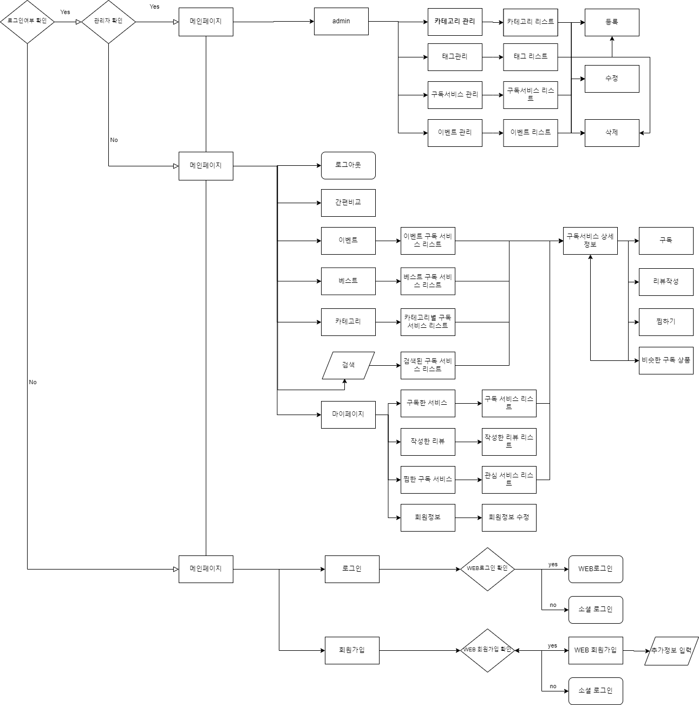

### 2. ERD테이블

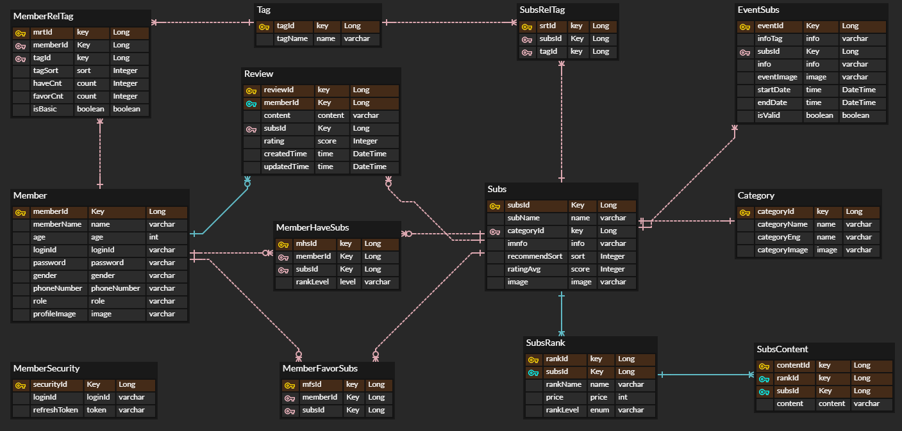

> [[백엔드] ERD테이블 링크](https://www.erdcloud.com/d/gvnDR33HcRn6uZk2M)

## 💡 사용자 페이지 기능 소개

### 1. 메인페이지 : 이벤트배너/전체카테고리/맞춤서비스 추천

> [[백엔드] 추천서비스 관련 주요코드 링크](https://github.com/injun0607/ggudok/blob/master/src/main/java/com/alham/ggudok/controller/HomeController.java#L108)

> [[백엔드] 태그 추천 시스템 관련 주요코드 링크](https://github.com/injun0607/ggudok/blob/master/src/main/java/com/alham/ggudok/service/member/MemberService.java#L417)

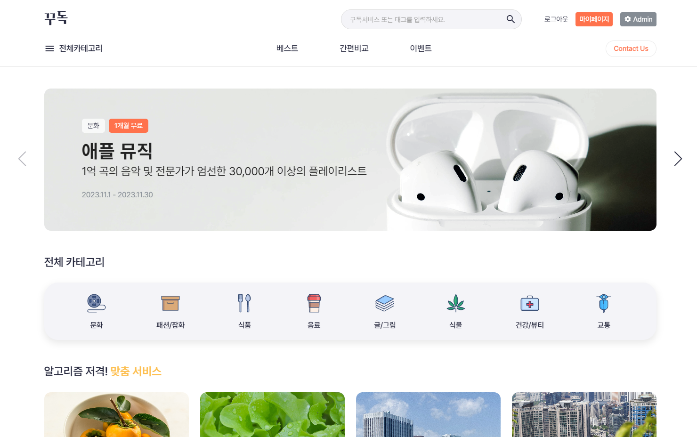

메인페이지의 이벤트배너와 전체 카테고리 아래에는 두 가지의 `추천 서비스 슬라이더`가 있습니다. **유저가 로그인했을 경우 "선호하는 태그"와 "성별과 나이"에 맞추어 각각 추천**하고, 로그인하지 않았을 경우 인기 순으로 추천합니다.
<table>
  <tr>
    <td>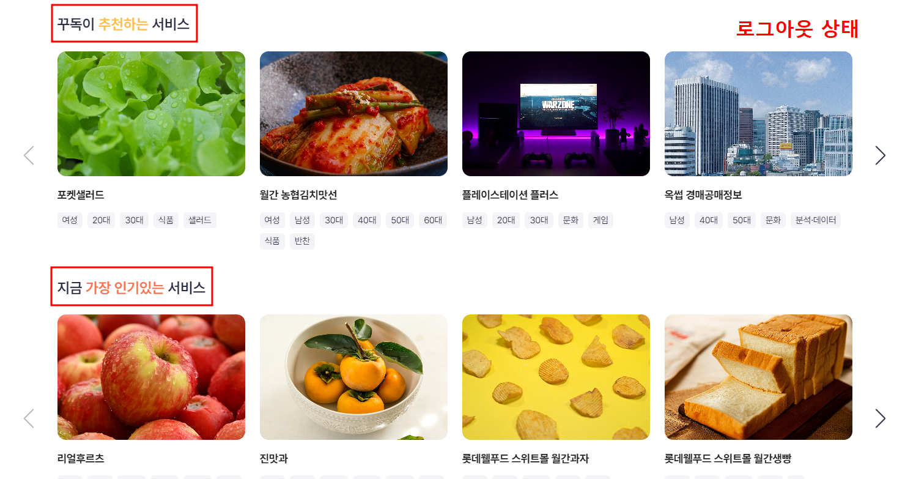</td>
    <td>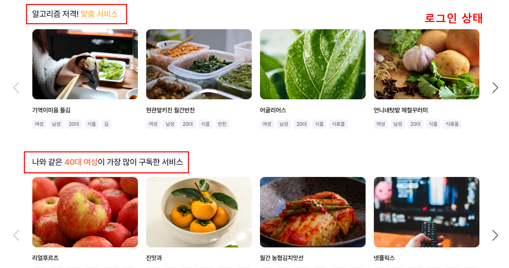</td>
  </tr>
</table>

### 2. 베스트

> [[백엔드] 인기서비스 관련 주요코드 링크](https://github.com/injun0607/ggudok/blob/master/src/main/java/com/alham/ggudok/controller/HomeController.java#L233)

> [[백엔드] 인기서비스 추천 시스템 주요코드 링크](https://github.com/injun0607/ggudok/blob/master/src/main/java/com/alham/ggudok/service/subs/SubsService.java#L225)

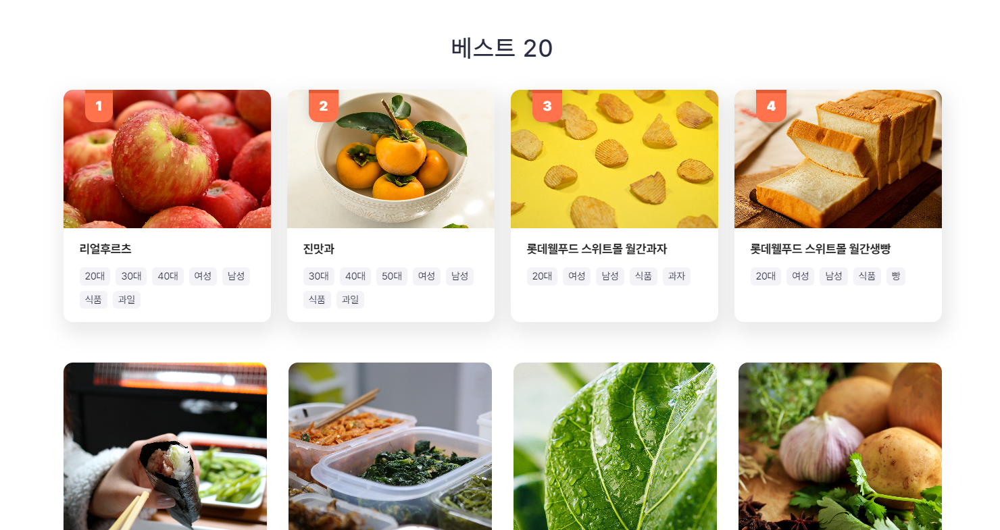

알고리즘에 따라 **가장 인기있는 구독서비스 20개**가 노출됩니다. 1위부터 4위까지는 순위 라벨을 붙여 정보전달력을 높였습니다.

### 3. 간편비교

> [[프론트엔드] 간편비교 기능 관련 주요코드 링크](https://github.com/Zoey-Sunlight/ggudok/blob/main/src/pages/Compare.js#L70)

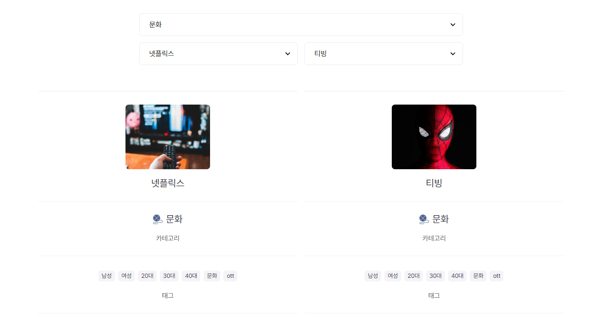

카테고리를 우선 선택한 후, 카테고리 내의 **두 가지 구독서비스를 골라 한 눈에 비교**할 수 있습니다.

### 4. 이벤트

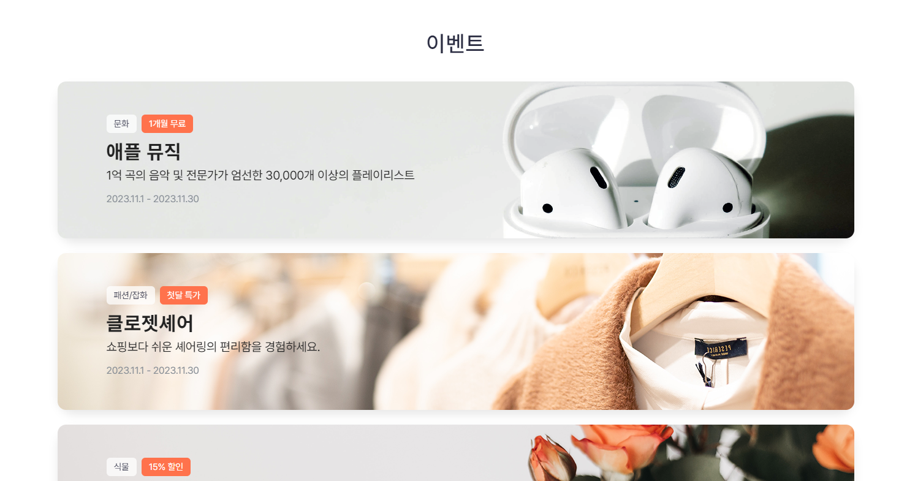

관리자가 등록한 **진행중인 이벤트**를 배너이미지와 함께 확인할 수 있습니다. 이벤트의 상세 설명과 이벤트 기간이 표시됩니다.

### 5. 카테고리별 리스트 : 필터, 구독서비스 리스트

> [[프론트엔드] 필터 기능 관련 주요코드 링크](https://github.com/Zoey-Sunlight/ggudok/blob/main/src/pages/Itemlist.js#L88)

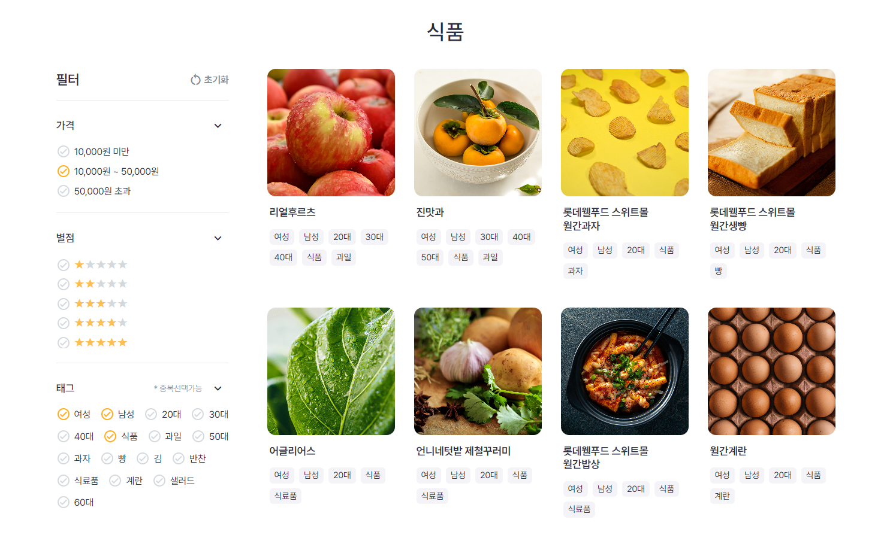

해당 카테고리에 등록된 서비스 리스트입니다. **`필터` 내의 가격/별점/태그 체크를 통해** 원하는 구독서비스를 골라 볼 수 있습니다. 필터의 태그에는 카테고리에 등록된 서비스들의 태그가 노출됩니다.

### 6. 검색결과 : 구독서비스명 또는 태그명

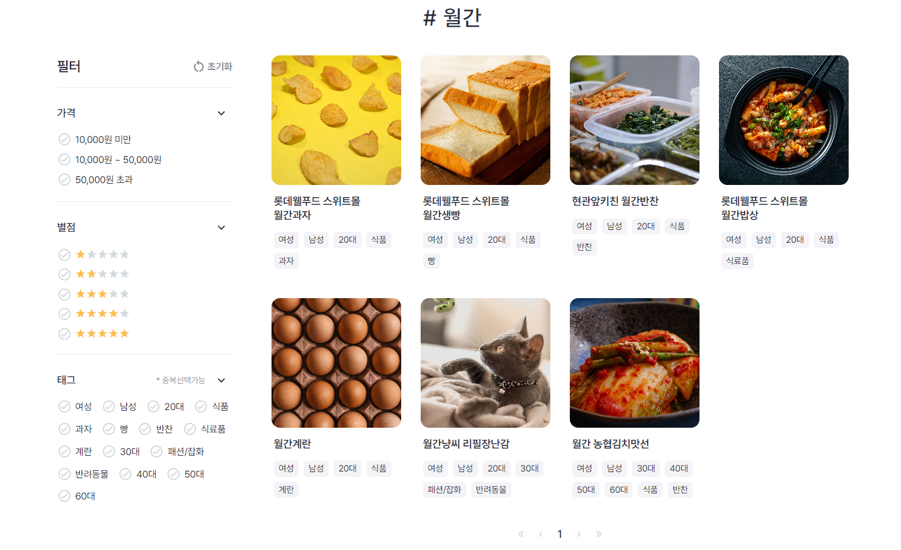

검색결과 페이지에서는 **유저가 검색한 검색어를 기반으로 일치하는 구독서비스명 또는 태그를 가진 구독서비스**를 볼 수 있습니다. 통합검색 결과 내에서 `필터`를 통해 추가적으로 유저가 원하는 서비스를 골라낼 수 있습니다.

### 7. 구독서비스 상세페이지

> [[프론트엔드] 리뷰작성 기능 관련 주요코드 링크](https://github.com/Zoey-Sunlight/ggudok/blob/main/src/pages/ItemDetail.js#L364)

> [[백엔드] 구독서비스 기능 관련 주요코드 링크](https://github.com/injun0607/ggudok/blob/master/src/main/java/com/alham/ggudok/controller/subs/SubsController.java#L110)

<table>
  <tr>
    <td>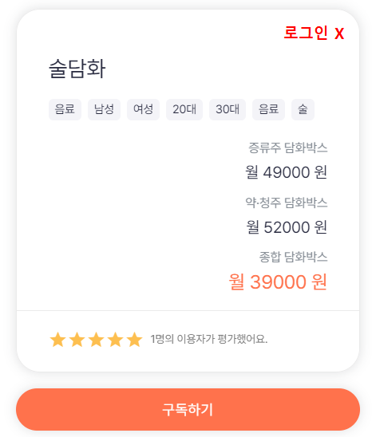</td>
    <td>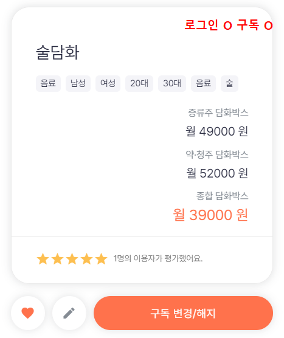</td>
  </tr>
</table>

상세페이지에는 좌측에는 `구독서비스 카드`가 위치하고, 우측에는 `상세정보`가 위치합니다.
구독서비스 카드에는 **구독서비스명과 태그, 요금, 평균 별점과 리뷰 작성자 수**가 들어갑니다. 또한 `구독서비스 관련 버튼`이 위치합니다. 구독하기 버튼 외에, **로그인했을 경우찜하기 버튼**이 노출되고, **구독중인 경우 구독하기 버튼이 구독변경/해지 버튼으로 대체되며, 리뷰작성 버튼이 노출**됩니다.

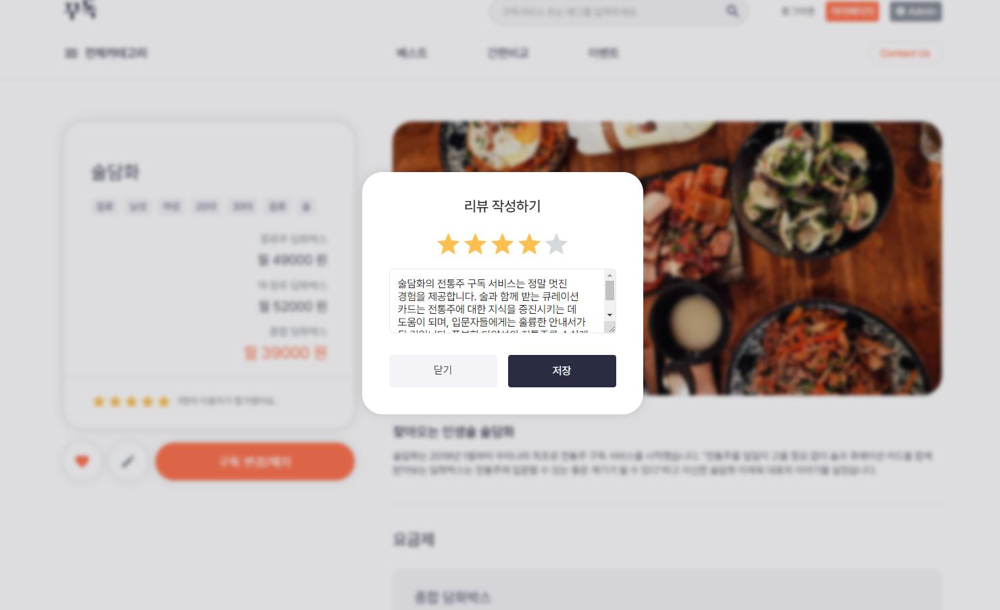

리뷰작성 버튼을 누르면 `팝업`이 열리며, 사용자는 **별점과 한줄리뷰를 작성**할 수 있습니다.

<table>
  <tr>
    <td>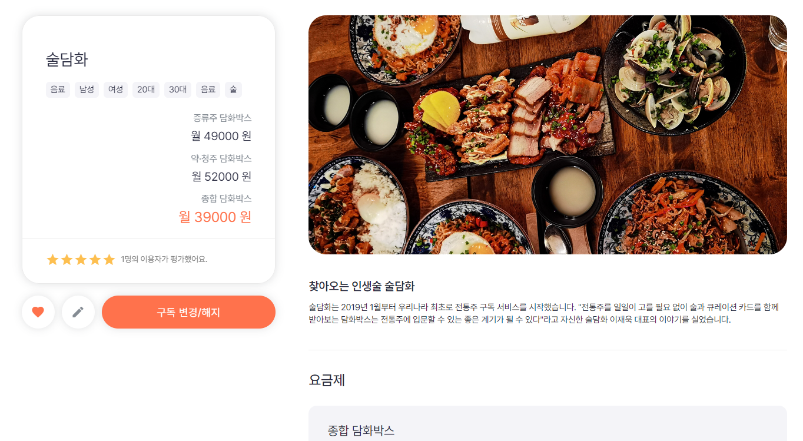</td>
    <td>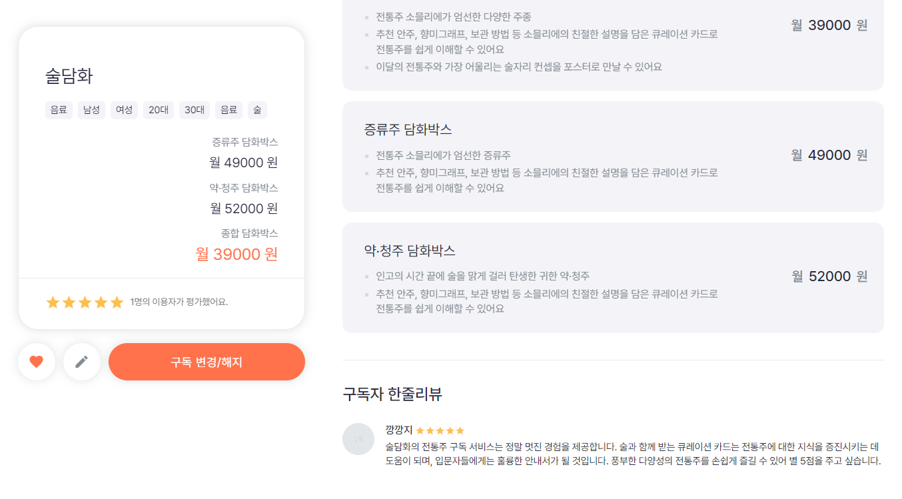</td>
  </tr>
</table>
<!-- ||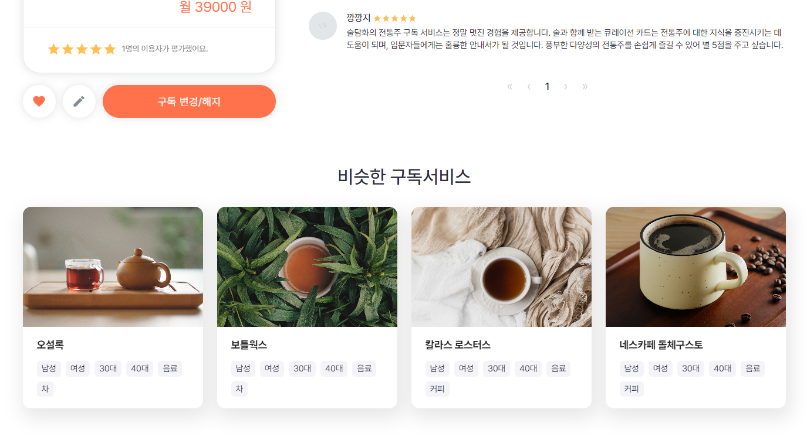
---|---|---|  -->

우측 상세정보란에는 **구독서비스의 대표 이미지와 설명**이 들어갑니다. 또한 `요금제 섹션`에는 각 요금제명과 함께 상세한 혜택과 한달 기준 요금이 들어갑니다. `구독자 한줄리뷰 섹션`에는 해당 서비스를 구독중인 회원들이 작성한 리뷰가 들어갑니다.

상세페이지의 맨 하단에는 해당 **구독서비스와 비슷한 다른 서비스** 4가지를 추천합니다.

### 8. 구독하기, 구독변경/해지

<table>
  <tr>
    <td>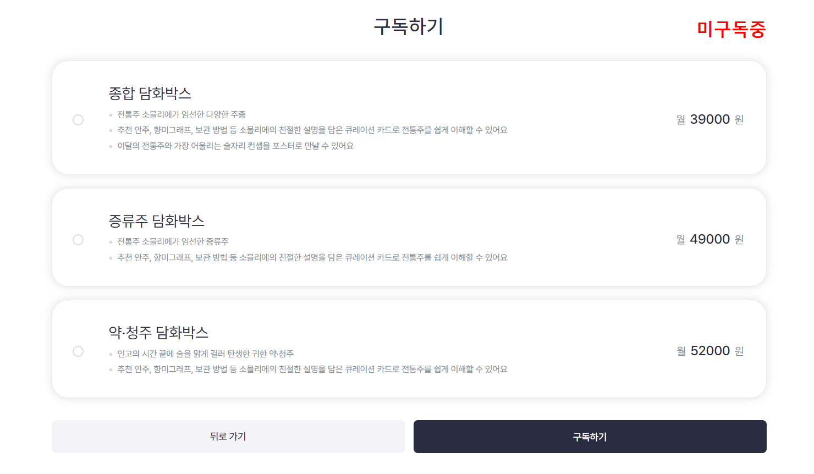</td>
    <td></td>
  </tr>
</table>

상세페이지에서 구독하기버튼을 누르면 구독하기 페이지로 이동됩니다. 구독하기 페이지에서는 **각 요금제와 혜택, 요금을 확인할 수 있으며 요금제를 선택하여 구독**할 수 있습니다.
**이미 구독하고 있는 경우, 구독변경/해지버튼**을 통해 해당 페이지로 이동됩니다. 이 페이지에서는 유저가 `현재 구독중인 요금제`가 상단에 표시되며, 다른 요금제를 체크해 구독요금제를 변경하거나 구독중인 서비스를 해지할 수 있습니다.

### 9. 로그인/회원가입

JWT 토큰 방식을 통해 로그인 상태를 관리하고 있습니다.

<table>
  <tr>
    <td>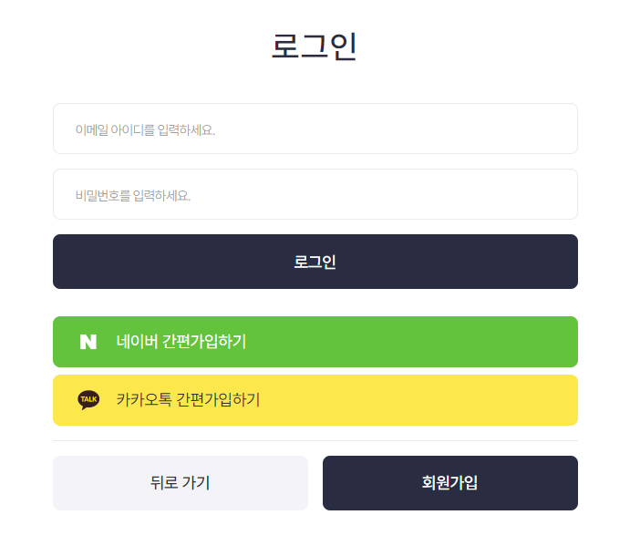</td>
    <td>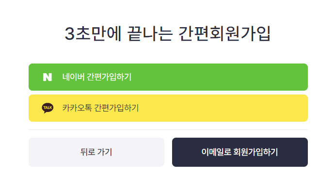</td>
  </tr>
</table>

네이버와 카카오톡 **소셜 로그인 및 회원가입**이 가능합니다. 유저가 이메일 회원가입을 선택한 경우, **이메일로 회원가입**할 수 있습니다.

<table>
  <tr>
    <td>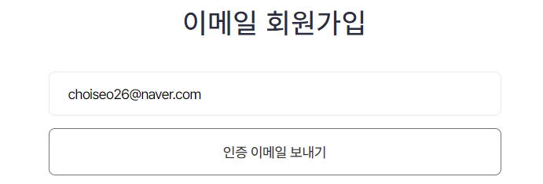</td>
    <td>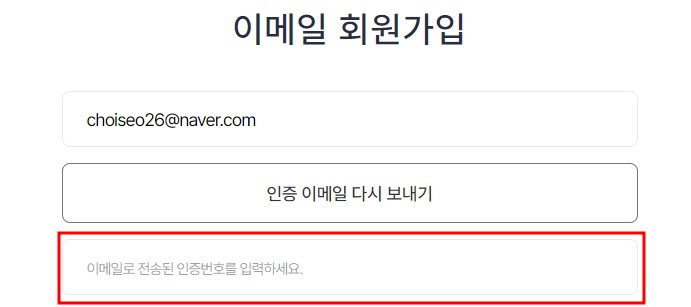</td>
  </tr>
</table>

유저는 입력한 이메일 아이디에 인증번호를 보내 **이메일을 인증하는 절차**를 거쳐야 합니다.

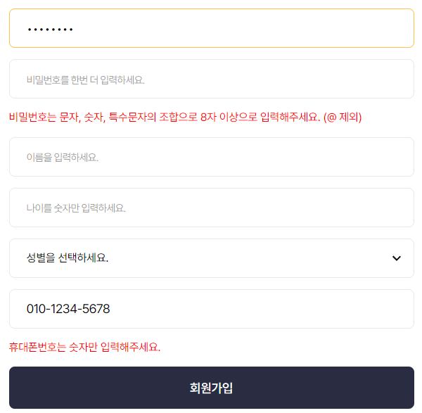

이메일로 회원가입한 유저는 비밀번호와 이름, 나이, 성별, 휴대폰번호를 작성하게 되며, **유효성검사**를 거치게 됩니다. 소셜로그인 유저는 나이와 성별, 휴대폰번호를 작성하게 됩니다.

### 10. 회원정보수정

> [[프론트엔드] 회원정보수정 기능 관련 주요코드 링크](https://github.com/Zoey-Sunlight/ggudok/blob/main/src/pages/Auth/EditProfile.js#L64)

<table>
  <tr>
    <td>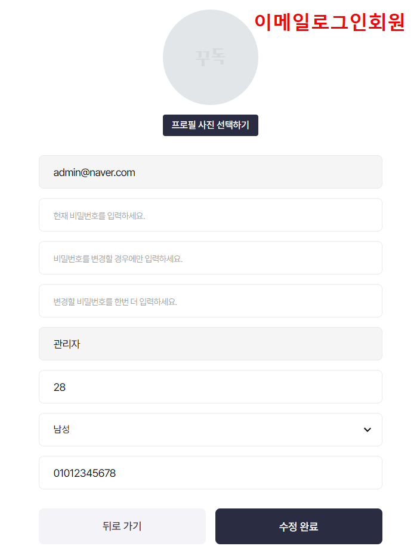</td>
    <td>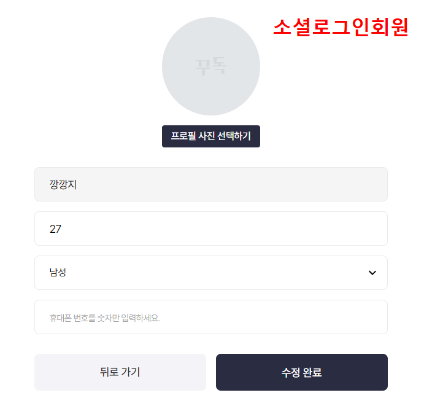</td>
  </tr>
</table>

유저는 마이페이지의 회원정보수정 페이지에서 **프로필 사진을 변경**할 수 있습니다. **이메일로 회원가입한 회원은 회원가입시 작성한 정보를 아이디와 이름을 제외하고 수정**할 수 있으며, **소셜 회원의 경우에는 나이, 성별, 휴대폰번호를 수정**할 수 있습니다.

### 11. 마이페이지 : 11-1. 나의 구독내역

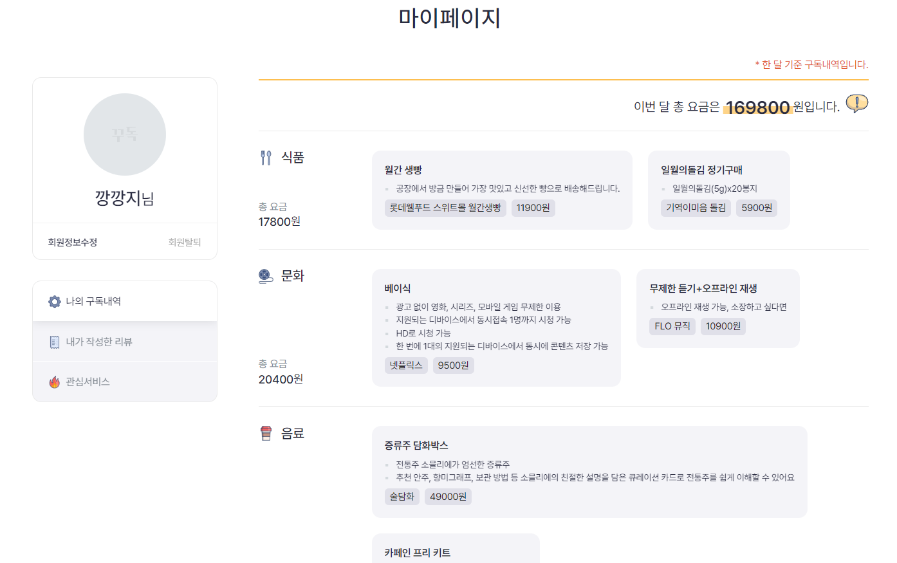

유저의 **이번 달 총 요금**을 맨 상단에서 확인할 수 있습니다. 또한 **카테고리별로 지출하는 카테고리별 요금**과 **구독중인 서비스의 혜택, 각 요금**을 확인할 수 있습니다.

### 11. 마이페이지 : 11-2. 내가 작성한 리뷰

> [[프론트엔드] 리뷰내역 기능 관련 주요코드 링크](https://github.com/Zoey-Sunlight/ggudok/blob/main/src/pages/Mypage/MyReview.js#L102)

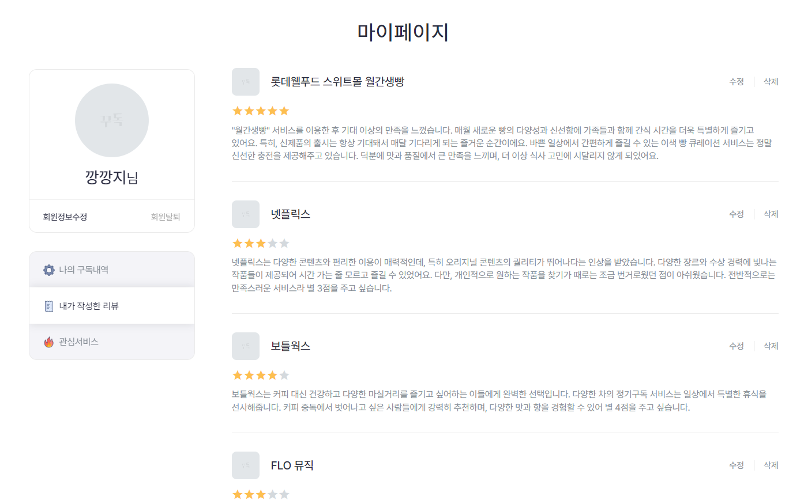

유저가 **작성한 모든 리뷰를 관리**할 수 있습니다. 유저는 수정 및 삭제버튼을 눌러 마이페이지에서 바로 수정하거나 삭제할 수 있습니다.

### 11. 마이페이지 : 11-3. 관심서비스

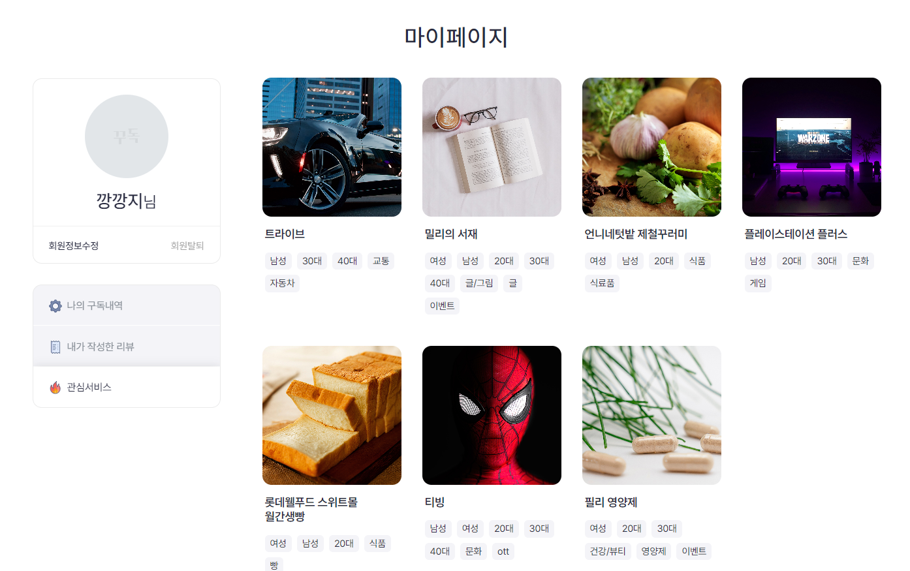

유저가 상세페이지에서 **찜하기 버튼을 누른 서비스**를 한 눈에 모아 볼 수 있습니다.

### 12. 편의성 기능 : 다크모드, 위로가기
<table>
  <tr>
    <td>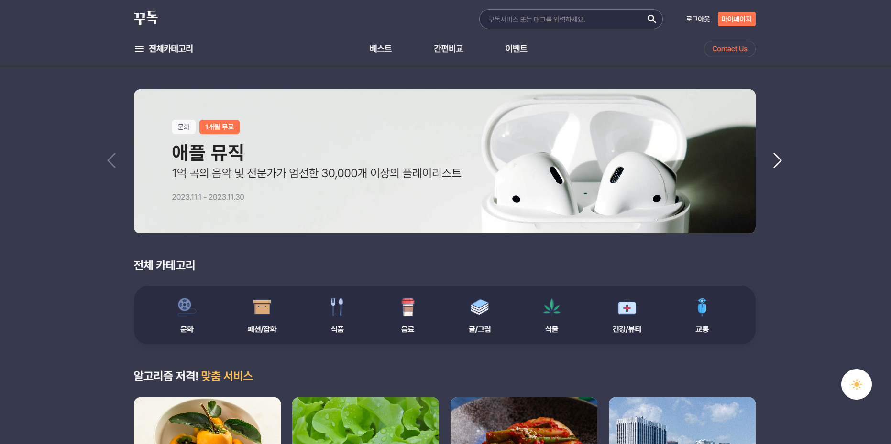</td>
    <td>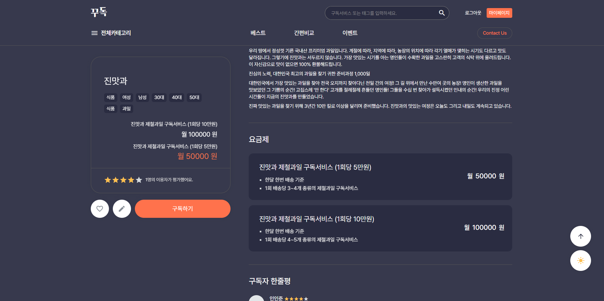</td>
  </tr>
</table>

**유저가 브라우저를 `다크모드`로 설정했거나, 다크모드 버튼을 클릭 시 꾸독을 다크모드로 이용**할 수 있습니다. 다크모드 기능 여부는 **로컬스토리지에 저장**되어 다시 사이트를 방문하더라도 저장됩니다. 또한 **일정 이상 스크롤을 내렸을 경우 `위로가기 버튼`이 생성**되어 스크롤을 길게 내려야 하는 페이지의 경우 바로 맨 위로 올라갈 수 있습니다.

## 🔨 관리자 페이지 기능 소개

### 1. 메인대시보드 : 카테고리/구독서비스/태그/이벤트 관리

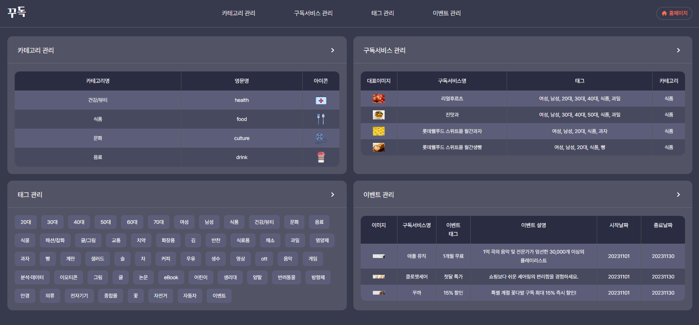

### 2. 카테고리 관리 : 리스트, 등록, 수정, 삭제

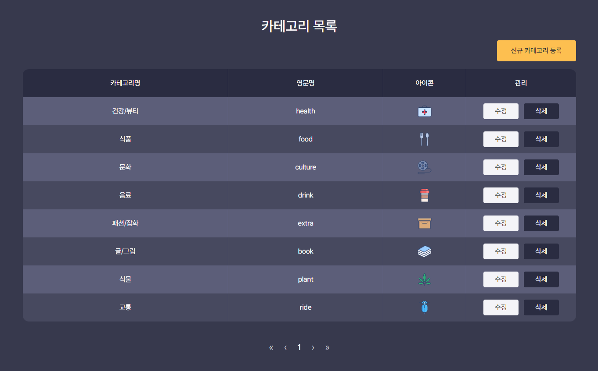

카테고리 관리 페이지에서는 **등록한 카테고리명과 영문명, 아이콘을 확인** 할 수 있으며, **각 카테고리를 수정하거나 삭제**할 수 있습니다. 또한 **신규 카테고리를 등록**할 수 있습니다.

<table>
  <tr>
    <td>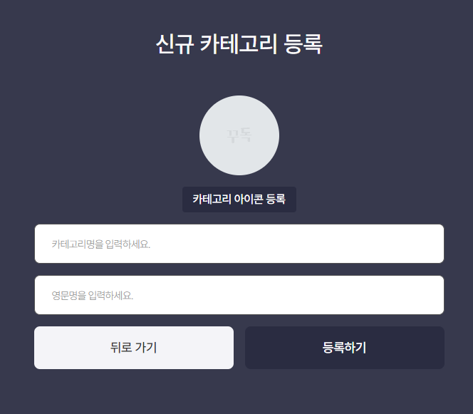</td>
    <td>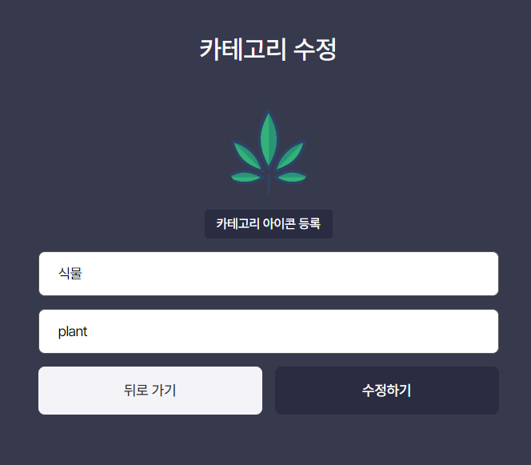</td>
  </tr>
</table>

### 3. 구독서비스 관리 : 리스트, 등록, 수정 삭제

> [[프론트엔드] 구독서비스 등록 관련 주요코드 링크](https://github.com/Zoey-Sunlight/ggudok/blob/main/src/pages/Admin/ItemsCreate.js#L69)

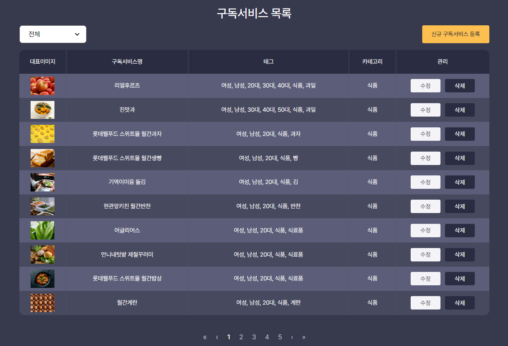

구독서비스 관리 페이지에서는 각 구독서비스를 셀렉박스를 통해 **카테고리별로 서비스를 필터링**할 수 있으며, **각 서비스를 수정하거나 삭제**할 수 있습니다.

<table>
  <tr>
    <td>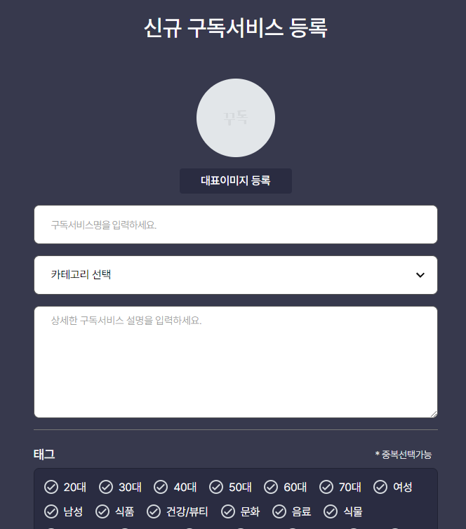</td>
    <td>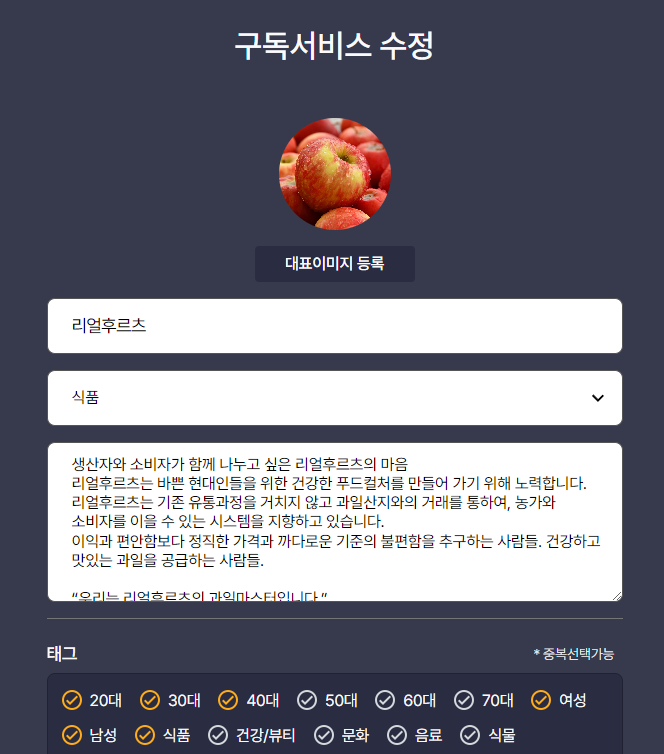</td>
  </tr>
</table>

구독서비스 **등록/수정페이지**에서는 대표이미지를 등록하고, 카테고리를 선택합니다. 또한, 상세 구독서비스 설명을 작성하고 관련 태그를 중복 선택할 수 있습니다.

<table>
  <tr>
    <td>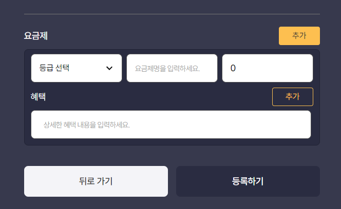</td>
    <td>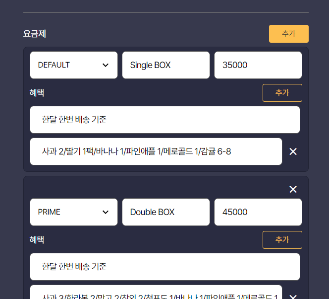</td>
  </tr>
</table>

구독서비스의 **요금제는 기본 DEFAULT 등급부터 선택 가능**하며, 요금제명과 요금을 작성할 수 있습니다. **상세 혜택은 기본 1개부터 추가버튼을 눌러 추가 작성**할 수 있습니다. **요금제 또한 추가버튼을 눌러 추가**할 수 있습니다.

### 4. 태그 관리 : 리스트, 등록, 삭제

<table>
  <tr>
    <td>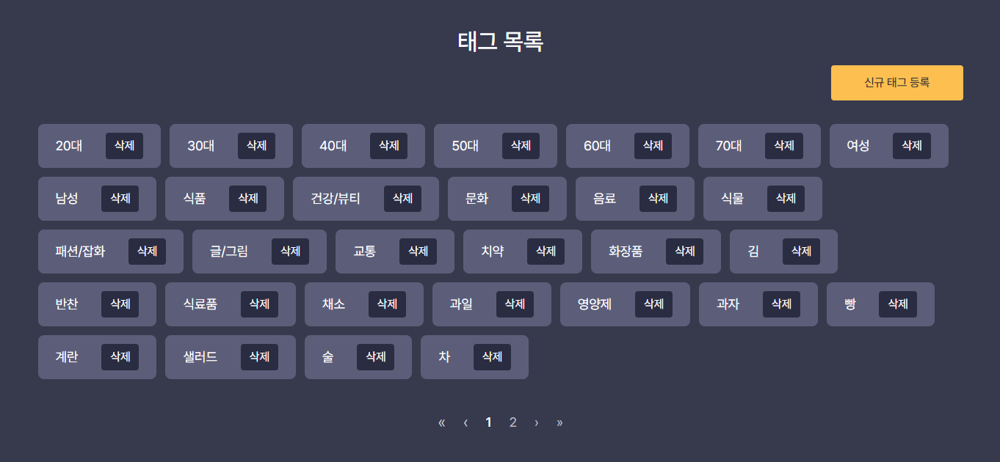</td>
    <td>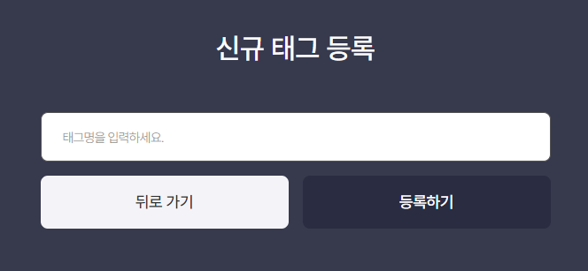</td>
  </tr>
</table>

태그 관리 페이지에서는 **등록한 태그를 확인** 할 수 있으며, **각 태그를 삭제하거나 신규 태그를 등록**할 수 있습니다.

### 5. 이벤트 관리 : 리스트, 등록, 삭제

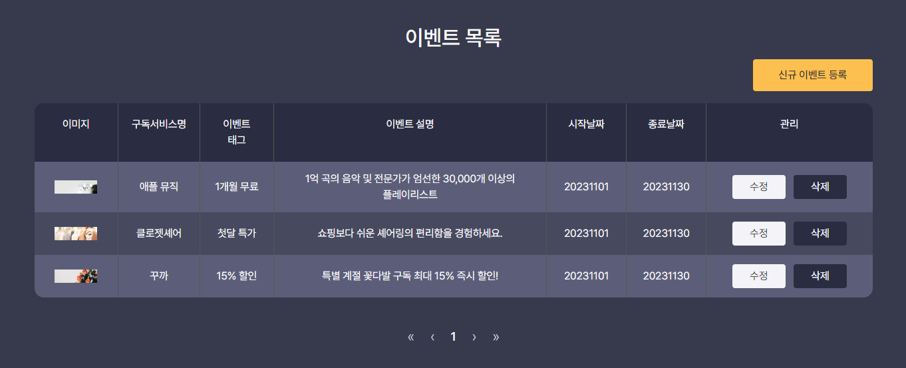

이벤트 관리 페이지에서는 **등록한 이벤트**의 대표이미지와 해당 이벤트의 구독서비스명, 이벤트 태그, 설명, 이벤트 기간을 확인할 수 있습니다. **각 이벤트를 수정하거나 삭제**하고, **새 이벤트를 등록**할 수 있습니다.

<table>
  <tr>
    <td>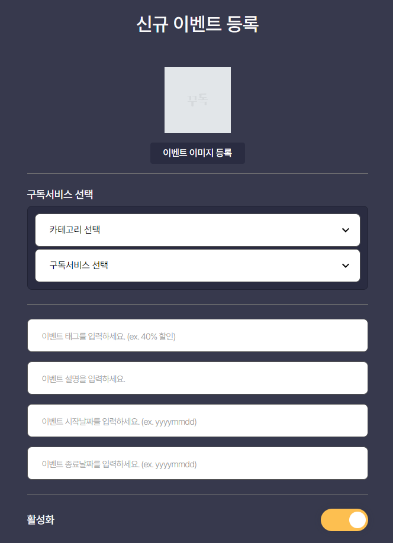</td>
    <td>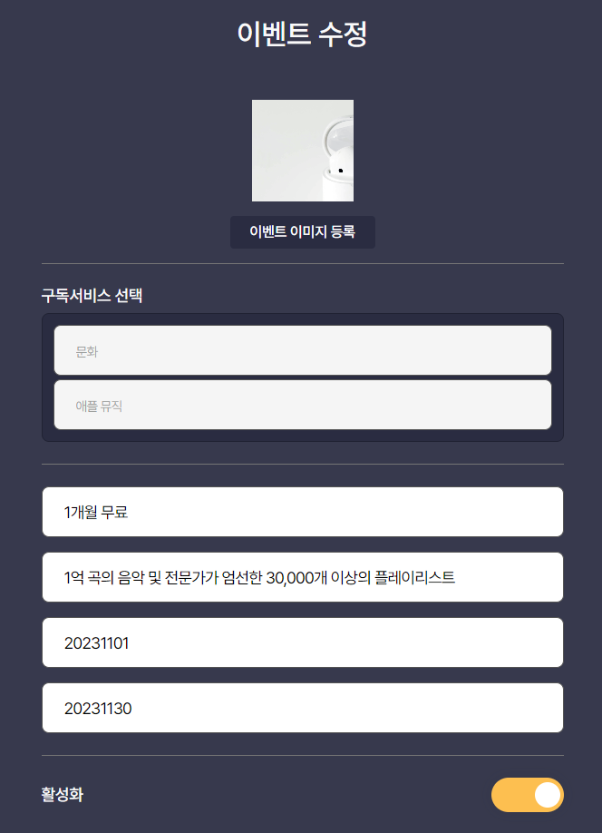</td>
  </tr>
</table>

## 😥 아쉬운 점과 보완 방안

### 1. 프론트엔드
  - **React Redux 구조 :**
    - **아쉬웠던 점** : React Redux를 처음 사용하면서 데이터를 주고받는 함수들을 일관성 있게 구조화하지 못한 것이 아쉬웠습니다. 함수를 Redux actions에 작성할지, components/pages에 작성할지 일관된 규칙 없이 작성한 부분이 프로젝트의 일관성을 해치는 요소로 작용했습니다.
    - **보완 방안** : 프로젝트를 진행하며 React와 Redux의 상태 관리 기능의 의의와 사용법을 익히게 되었습니다. 앞으로는 Redux의 강력한 상태 관리 기능을 최대한 활용하면서, API 호출 및 상태 업데이트 함수를 일관된 구조로 관리할 필요가 있습니다. REST API 호출이나 외부 데이터 소스와의 상호 작용이 필요한 비동기 함수들을 명확하게 Redux action에 위치시키고, 컴포넌트 페이지에서 데이터를 불러와야 하는 경우 해당 컴포넌트 페이지에 상태 및 데이터를 관리하는 함수를 위치시키는 등으로 코드의 가독성과 유지보수성을 향상시키고, 공통된 가이드라인을 마련하여 유지보수 시 혼란을 최소화하겠습니다.

  - **전역 state 구분 :**
    - **아쉬웠던 점** : 전역 상태로 둘 state와 로컬 state를 명확하게 구분하지 못한 부분이 프로젝트의 일관성을 해친 것으로 생각됩니다.
    - **보완 방안** : 앞으로는 어떤 상태를 전역으로 관리할지, 그리고 어떤 상태는 로컬로 관리할지 명확히 정의하는 것이 필요합니다. Redux의 상태 관리 기능을 활용하여 필요한 상태를 효과적으로 공유하고, 로컬 상태는 컴포넌트 내에서 관리하여 컴포넌트 간 의존성을 최소화하겠습니다.

### 2. 백엔드

- **요금제 관련 코드의 추상화의 부족 :**
    - **아쉬웠던 점** : 서비스를 다 만든 후 실제 데이터를 넣는 상황에서 구독 서비스마다 다양한 옵션의 요금제가 있는것을 확인했습니다. 현재의 코드로는 3가지의 고정된 등급의 요금제만 사용할 수 있는 상황이라 다양한 선택옵션이 있는 요금제는 등록 할 수가 없었습니다. 요금제 관련 코드를 좀 더 추상화 시켰더라면 다양한 옵션의 요금제를 효과적으로 처리 할 수 있었다고 생각합니다.
    - **보완 방안** : 요금제정보를 가진 SubsRank 클래스의 상위 인터페이스를 선언하여 해당 인터페이스로 SubsRank가 등급으로 분류되는 요금제인지 다수의 선택옵션으로 분류되는 요금제인지 구분하여 코드를 처리 할 수있을 것 같습니다. 

- **다양한 예외처리의 부족 :**
    - **아쉬웠던 점** : API 통신시 다양한 에러에 맞는 예외를 던지지 못했습니다. 상황에 맞는 적절한 예외메시지와 정보들을 정리하여 전달하지 못한게 아쉬웠습니다.
    - **보완 방안** : 다양한 에러를 정리하여 일괄적으로 묶을 수 있는 예외클래스를 만들수 있다고 생각합니다. 해당 클래스에서는 어떤부분에서 에러가 나왔는지에 대한 정보와 예외메세지를 가지고 있으면 좋다고 생각합니다

## 📑 이미지/아이콘 소스 출처

> Icons by Orion Icon Library - https://orioniconlibrary.com,
> Images by Unsplash - https://unsplash.com/